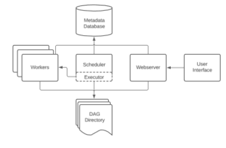

# **O que é Apache Airflow ?**

O Apache Airflow é uma plataforma de gerenciamento de fluxo de trabalho de código aberto para pipelines de engenharia de dados. Começou no Airbnb em outubro de 2014, como uma solução para gerenciar os fluxos de trabalho cada vez mais complexos da empresa.

[Documentação](https://airflow.apache.org/docs/apache-airflow/stable/)

# **Para que serve ?**

O Airflow permite a execução de diferentes tipos de tarefas através de operadores de diferentes naturezas, como o PythonOperator, para execução de scripts Python, o DockerOperator, para trabalho com contêineres do Docker ou até mesmo o BashOperator, para a execução de comandos bash.

# **Como funciona ?**

O objetivo do AIRFLOW é a orquestração de pipelines de tarefas agendadas por meio de scripts `Python` em conjunto com bibliotecas com instruções de sequenciamento definidas, chamados DAGs.

# **Qual é a Arquitetura ?**

# **Como instalar ?**

Como todas a aplicações do sistema, serão instalados em um contêiner Docker. Na documentação da imagem no DockerHUB é possível encontrar informações sobre esse procedimento.

[Repositório de referencia](https://github.com/NarayanaBehera/Apache-Airflow-With-Docker-)

[Video](https://www.youtube.com/watch?v=qCi7kYg8P9U&list=PL5Gz0w1wYE8mSSxoBN--A6RekoyCw74h0&index=3)

[Docker hub](https://hub.docker.com/r/bitnami/airflow)

[Airflow](https://github.com/danilosousadba/airflow)

# **Como é o funcionamento dentro do contêiner?**

O Airflow terá a funcionalidade de gerenciar todos os componentes possibilitando a consulta de informações de forma mais específica e direcionada para o que é necessário, dessa maneira é possível tem uma visão de todo o fluxo.

# **Quais são as suas dependencias ?**

O Airflow não possui dependências para o seu funcionamento, apenas é necessário que mantenha seus arquivos organizados e de fácil acesso, sendo o resto da configuração/instalação realizado pelo `docker-compose` da aplicação e pelo `dockerfile` na hora do deploy no [K8s](../k8s/README.md)

# **Componentes?**

Para mais detalhes visite esses sites:

- [Ilegra](https://ilegra.com/blog/apache-airflow-maestro-de-pipelines-de-tarefas-agendadas/)

- [Ahayasic](https://ahayasic.github.io/apache-airflow-in-a-nutshell/content/introduction_to_apache_airflow/essential_concepts_and_components/#referencias)

## **DAGs**

`Os DAGs agora serão o novo sistema de jobs por projeto `

Para criar uma DAG no Airflow, você sempre deve importar a classe DAG. Depois da classe DAG, vêm as importações de Operators. Basicamente, para cada Operator que deseja utilizar, deve-se fazer a importação correspondente.

`Aqui ele usa o S3 da amazon mas podemos usar o mesmo conceito`

- [Conexão banco](https://www.youtube.com/watch?v=fLl_7S4_P94&t=375s)

- [Primeiro DAGs](https://estevestoni.medium.com/criando-a-primeira-dag-no-airflow-em-10-minutos-5b135618fe18)

## **Web Server**

Responsável por disponbilizar a interface ao usuário.

[web server airflow](https://airflow.apache.org/docs/apache-airflow/stable/security/webserver.html)

## **Scheduler**

Responsável pelo agendamento dos fluxos de trabalho ou workflows

## **Metadata**

Um banco de dados onde serão armazenados todos os metadados relacionados ao próprio Airflow, mas também relacionados aos nossos dados, pipelines, tasks e assim por diante. Normalmente usamos o banco de dados do Postgres.

## **Executors**

Define como as tarefas serão executadas, seja com kubernetes, Celery ou até mesmo localmente.

## **Worker**

O processo/sub-processo onde as Tasks são executadas.

# **Como usar ?**

O uso do sitema vai ser feito por meio de deploy da sua maquina local para a produçao que vai ser pelo github e k8s para um contêiner docker onde vai ser convertido em dag no airflow.

[Start no docker](https://airflow.apache.org/docs/apache-airflow/stable/start/docker.html)

 Configuraçoes e variaveis de ambiente docker-compose 

### **Configuração**

Carregar arquivos DAG
Arquivos DAG personalizados podem ser montados em arquivos /opt/bitnami/airflow/dags.

### **Instalando módulos python adicionais**

Este contêiner suporta a instalação de módulos python adicionais no momento da inicialização. Para fazer isso, você pode montar um requirements.txtarquivo com suas necessidades específicas no caminho /bitnami/python/requirements.txt.

### **Variáveis ​​ambientais**

A instância do Airflow pode ser personalizada especificando variáveis ​​de ambiente na primeira execução. Os seguintes valores de ambiente são fornecidos para personalizar o Airflow:

### **Configuração do usuário**

- `AIRFLOW_USERNAME`: Nome de usuário do aplicativo Airflow. Padrão: usuário
- `AIRFLOW_PASSWORD`: Senha do aplicativo Airflow. Padrão: bitnami
- `AIRFLOW_EMAIL`: E-mail do aplicativo Airflow. Padrão: user@example.com

### **Configuração do fluxo de ar**

- `AIRFLOW_EXECUTOR`: Executor de fluxo de ar. Padrão: SequentialExecutor
- `AIRFLOW_FERNET_KEY`: Chave de fluxo de ar Fernet. Sem padrões.
- `AIRFLOW_SECRET_KEY`: Chave secreta do fluxo de ar. Sem padrões.
- `AIRFLOW_WEBSERVER_HOST`: Host do servidor web Airflow. Padrão: 127.0.0.1
- `AIRFLOW_WEBSERVER_PORT_NUMBER`: Porta do servidor web Airflow. Padrão: 8080
- `AIRFLOW_LOAD_EXAMPLES`: Para carregar tarefas de exemplo no aplicativo. Padrão: sim
- `AIRFLOW_BASE_URL`: URL base do servidor da Web do Airflow. Sem padrões.
- `AIRFLOW_HOSTNAME_CALLABLE`: Método para obter o nome do host. Sem padrões.
- `AIRFLOW_POOL_NAME`: Nome do conjunto. Sem padrões.
- `AIRFLOW_POOL_SIZE`: Tamanho da piscina, necessário com AIRFLOW_POOL_NAME. Sem padrões.
- `AIRFLOW_POOL_DESC`: Descrição do pool, necessária com AIRFLOW_POOL_NAME. Sem padrões.

### **Use um banco de dados existente**

- `AIRFLOW_DATABASE_HOST`: Nome do host do servidor PostgreSQL. Padrão: postgresql
- `AIRFLOW_DATABASE_PORT_NUMBER`: Porta utilizada pelo servidor PostgreSQL. Padrão: 5432
- `AIRFLOW_DATABASE_NAME`: nome do banco de dados que o Airflow usará para se conectar ao banco de dados. Padrão: bitnami_airflow
- `AIRFLOW_DATABASE_USERNAME`: usuário do banco de dados que o Airflow usará para se conectar ao banco de dados. Padrão: bn_airflow
- `AIRFLOW_DATABASE_PASSWORD`: Senha do banco de dados que o Airflow usará para se conectar ao banco de dados. Sem padrões.
- `AIRFLOW_DATABASE_USE_SSL`: Defina como sim se o banco de dados estiver usando SSL. Padrão: não
- `AIRFLOW_REDIS_USE_SSL`: Defina como sim se o Redis(R) usar SSL. Padrão: não
- `REDIS_HOST`: Nome do host para o servidor Redis(R). Padrão: redis
- `REDIS_PORT_NUMBER`: Porta usada pelo servidor Redis(R). Padrão: 6379
- `REDIS_USER`: usuário que o Airflow usará para se conectar ao Redis(R). Sem padrões.
- `REDIS_PASSWORD`: Senha que o Airflow usará para se conectar ao Redis(R). Sem padrões.
- `REDIS_DATABASE`: Número do banco de dados para o servidor Redis(R). Padrão: 1

### **Autenticação LDAP do Airflow**

- `AIRFLOW_LDAP_ENABLE`: ative a autenticação LDAP. Padrão: não
- `AIRFLOW_LDAP_URI`: URI do servidor LDAP. Sem padrões.
- `AIRFLOW_LDAP_SEARCH`: base de pesquisa LDAP. Sem padrões.
- `AIRFLOW_LDAP_UID_FIELD`: campo LDAP usado para uid. Sem padrões.
- `AIRFLOW_LDAP_BIND_USER`: nome de usuário LDAP. Sem padrões.
- `AIRFLOW_LDAP_BIND_PASSWORD`: Senha do usuário LDAP. Sem padrões.
- `AIRFLOW_USER_REGISTRATION`: Auto-registro do usuário. Padrão: Verdadeiro
- `AIRFLOW_USER_REGISTRATION_ROLE`: Função para o usuário criado. Sem padrões.
- `AIRFLOW_LDAP_ROLES_MAPPING`: Mapeamento do DN do LDAP para uma lista de funções do Airflow. Sem padrões.
- `AIRFLOW_LDAP_ROLES_SYNC_AT_LOGIN`: Substitua TODAS as funções do usuário a cada login, ou apenas no registro. Padrão: Verdadeiro
- `AIRFLOW_LDAP_USE_TLS`: Use SSL LDAP. Padrões: Falso .
- `AIRFLOW_LDAP_ALLOW_SELF_SIGNED`: Permitir certificados autoassinados em SSL LDAP. Padrão: Verdadeiro
- `AIRFLOW_LDAP_TLS_CA_CERTIFICATE`: Arquivo que armazena a CA para SSL do LDAP. Sem padrões.

- Além das variáveis ​​de ambiente anteriores, todos os parâmetros do arquivo de configuração podem ser substituídos usando variáveis ​​de ambiente com este formato: AIRFLOW**{SECTION}**{KEY}. Observe os sublinhados duplos.

### **Especificando variáveis ​​de ambiente usando o Docker Compose**

    version: '2'
        services:
        airflow:
            image: bitnami/airflow:latest
            environment:
            - AIRFLOW_FERNET_KEY=46BKJoQYlPPOexq0OhDZnIlNepKFf87WFwLbfzqDDho=
            - AIRFLOW_SECRET_KEY=a25mQ1FHTUh3MnFRSk5KMEIyVVU2YmN0VGRyYTVXY08=
            - AIRFLOW_EXECUTOR=CeleryExecutor
            - AIRFLOW_DATABASE_NAME=bitnami_airflow
            - AIRFLOW_DATABASE_USERNAME=bn_airflow
            - AIRFLOW_DATABASE_PASSWORD=bitnami1
            - AIRFLOW_PASSWORD=bitnami123
            - AIRFLOW_USERNAME=user
            - AIRFLOW_EMAIL=user@example.com
