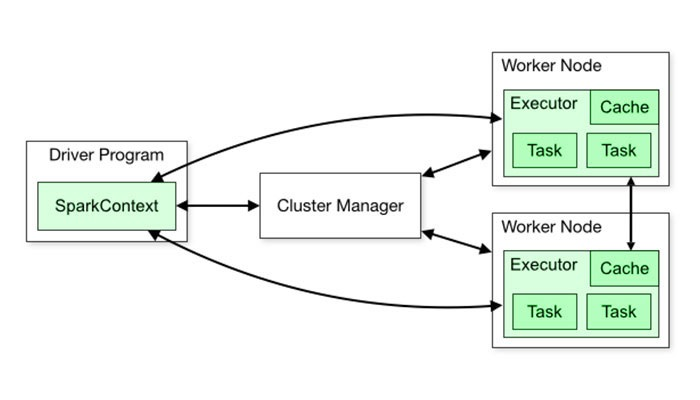

# **O que é o Apache Spark?**

O Apache Spark é um mecanismo de análise unificado para processamento de dados em grande escala com módulos integrados para SQL, streaming, machine learning e processamento de gráficos. O Spark pode ser executado no Apache Hadoop, Apache Mesos, Kubernetes, por conta própria, na nuvem e em diversas fontes de dados.

- Por exemplo, o master Node é responsável por gerenciamento a forma como o processamento deverá ocorrer em todas as outras máquinas, ao mesmo tempo que, também executará.

[Documentação](https://spark.apache.org/documentation.html)

# **Para que server ?**

Com sua estrutura de processamento paralelo em software livre, ele dá suporte ao processamento na memória, aprimorando, assim, o desempenho de aplicativos que analisam Big Data.

Este atua com o propósito de processar grandes conjuntos de dados de forma simultânea e distribuída.

Desse modo, o Spark serve para facilitar o desenvolvimento de aplicações de processamento de grandes volumes de dados.

Outra vantagem é que algoritmos iterativos de machine learning são facilmente implementados por meio do software. Além disso, ao utilizá-lo, os usuários podem se conectar a qualquer fonte de dados e apresentá-la como tabelas para uso em SQL.

# **Como funciona ?**

- O funcionamento vai depender do modulo que vc quer usar e oque vc vai fazer com a parte dos dados que voce adquiriu

- Spark é um outro framework de execução. Assim como o MapReduce, que funciona com um sistema de arquivos para distribuir os seus dados através do cluster e processá-los em paralelo. Ele também tem um conjunto de instruções de um aplicativo escrito por um desenvolvedor. O MapReduce foi codificado a partir do Java.

# **Qual e a Arquitetura ?**

[Arquitetura Basica](https://blog.dsacademy.com.br/serie-spark-e-databricks-parte-1-arquitetura-e-componentes-do-apache-spark/)

[Arquitetura spark](https://www.hammerlab.org/2015/07/25/spree-58-a-live-updating-web-ui-for-spark/)

A Arquitetura principal da ferramenta e essa que podemos ver abaixo e existe mais 3 versoes que se adapta em cada caso para uma finalidade a local, client e cluster cada uma para fazer uma coisa.

# **Como instalar ?**

Vamos seguir como exemplo esse dois arquivos que e onde baixaremos a imagem e outro de configuração

- A imagem usada sera a imagem da bitnami

[Docker-hub](https://hub.docker.com/r/bitnami/spark)

[Artigo](https://phoenixnap.com/kb/install-spark-on-ubuntu)

[devmedia](https://www.devmedia.com.br/introducao-ao-apache-spark/34178)

[desenvolvimento spark](https://www.stxnext.com/blog/docker-jupyterlab-apache-livy-rest-api-apache-spark/)

[Videos](https://www.youtube.com/watch?v=Zr_FqYKC6Qc)

[Instalaçao Saprk](https://www.youtube.com/watch?v=luiJttJVeBA&t=55s)

# **Como funciona dentro do container ?**

- Cada worker tem um container no docker executa as suas task que sao`automatizadas pelo Airflow`

- Os benefícios do uso de contêineres do Docker são bem conhecidos: eles fornecem ambientes consistentes e isolados para que os aplicativos possam ser implantados em qualquer lugar — localmente, em ambientes de desenvolvimento/teste/produção, em todos os provedores de nuvem e no local — de maneira repetível .

[Construção de imagem](https://towardsdatascience.com/spark-and-docker-your-spark-development-cycle-just-got-10x-faster-f41ed50c67fd)

# **Quais sao suas dependencias ?**

## **Módulos Spark**

Tudo vai depender do desenvolvedor para poder trabalha com esses módulos.Abaixo tem uma breve definição e os links de cada documentação

- [SQL](http://spark.apache.org/sql/) - Módulo que trabalha com dados estruturados,

- [Streaming](http://spark.apache.org/streaming/) - Processamento de dados in real-time, o dados podem derivar de diversas fontes como Kafka, Flume e HDFS.

- [MLLib (Machine Learning)](http://spark.apache.org/mllib/) - Para Machine Learn.

- [GraphX (graph)](http://spark.apache.org/graphx/) - Para manipular graficamente os dados.

# **Componentes ?**

[Ecossistema spark](https://cloud.google.com/learn/what-is-apache-spark?hl=pt-br)

## **Driver**

- O Driver Program, que é a aplicação principal que gerencia a criação e é quem executará o processamento definido pelo programados;

## **Cluster Manager**

- O Cluster Manager é um componente opcional que só é necessário se o Spark for executado de forma distribuída. Ele é responsável por administrar as máquinas que serão utilizadas como workers;

- O Cluster Manager é um componente opcional que só é necessário se o Spark for executado de forma distribuída. Ele é responsável por administrar as máquinas que serão utilizadas como workers; Os Workers, que são as máquinas que realmente executarão as tarefas que são enviadas pelo Driver Program.

## **Workers**

- Os Workers, que são as máquinas que realmente executarão as tarefas que são enviadas pelo Driver Program. Se o Spark for executado de forma local, a máquina desempenhará tanto o papel de Driver Program como de Worker.

## **Pyspark**

Para uso geral das atividades com a ferramenta e recomendado usar o pyspark para fazer transformaçoes em geral

[pyspark](https://realpython.com/pyspark-intro/)

[Spark](https://www.youtube.com/watch?v=ofPDOmMKRis)

[Tableau](https://help.tableau.com/current/pro/desktop/pt-br/examples_sparksql.htm)

[Video](https://www.youtube.com/watch?v=wZwY2r3aUIo)

[Kubernetes spark](https://datenworks.com/quickstart-como-rodar-apache-spark-no-kubernetes/)

[donwload jar](https://jar-download.com/artifacts/org.apache.spark)
[arquivo pom](https://mvnrepository.com/artifact/org.apache.spark/spark-sql-kafka-0-10_2.12/3.0.0)
